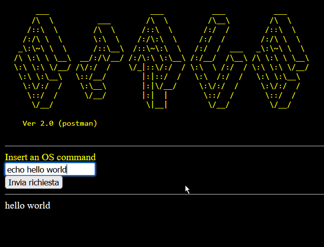

# SiRuS
A simple, yet sample, **TLS webshell in Rust**.

## ver. 2.0 
- Now commands are sent using POST request

## How does it work
Just lunch the compiled executable **sirus** passing the certificate (PKCS#12 format) password as parameter:

    sirus Zinz#72
The certificate is embedded as binary resource, of course you can change it to include your own certificate, that must be placed in the **src** folder, at the same level of the source file main.rs, then change the string literal ("zinz.pfx") around line 80.
The server listens to the port **8443** on all IPV4 available interfaces, you can change this value around line 17 of main.rs. 
Once the server is running
    
    https:https://127.0.0.1:8443 
you can send commands through the form:
<br><br>
The command parameter's value is executed against the server OS. The output, eventually the error, is returned into the web page response through the TLS stream.

## Compiling the software
The software has been compiled on
-  Microsoft Windows 11 Education
10.0.22621 N/D build 22621 (X64)

```bash
cargo b
   Compiling lazy_static v1.4.0
   Compiling urlencoding v2.1.2
   Compiling windows_x86_64_msvc v0.36.1
   Compiling windows-sys v0.36.1
   Compiling schannel v0.1.20
   Compiling native-tls v0.2.10
   Compiling sirus v0.1.0 (C:\Users\*******\source\rust\sirus)
    Finished dev [unoptimized + debuginfo] target(s) in 12.11s
```

- Parrot OS 5.2 (Electro Ara) Linux parrotos-vm 6.0.0-12parrot1-amd64 #1 SMP PREEMPT_DYNAMIC Debian 6.0.12-1parrot1 (2023-01-12) x86_64 GNU/Linux


```bash
$cargo b
   Compiling openssl-sys v0.9.77
   Compiling libc v0.2.136
   Compiling syn v1.0.103
   Compiling quote v1.0.21
   Compiling openssl v0.10.42
   Compiling cfg-if v1.0.0
   Compiling foreign-types-shared v0.1.1
   Compiling log v0.4.17
   Compiling foreign-types v0.3.2
   Compiling once_cell v1.15.0
   Compiling bitflags v1.3.2
   Compiling native-tls v0.2.10
   Compiling openssl-probe v0.1.5
   Compiling urlencoding v2.1.2
   Compiling openssl-macros v0.1.0
   Compiling sirus v0.1.0 (/home/*******/sirus)
    Finished dev [unoptimized + debuginfo] target(s) in 31.49s

```

The TLS connection is manged with the [crate native-tls](https://crates.io/crates/native-tls), that uses **SChannel on Windows** (via the schannel crate) and **OpenSSL** (via the openssl crate) on Parrot OS.
If you want to run the program with cargo use the following syntax to pass the password certificate parameter:
```bash
cargo r -- Zinz#72
```

### Dependencies crates
- urlencoding
- native-tls

### Notes
On Parrot-OS you must have installed the following package:
- pkg-config
- openssl
- libssl-dev


